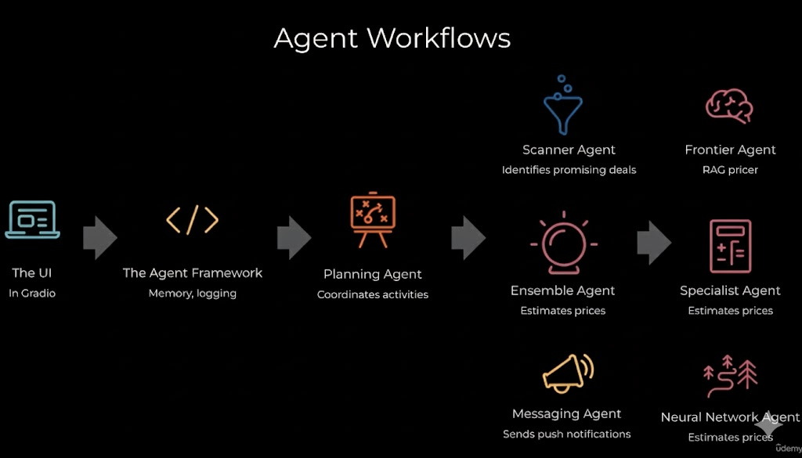
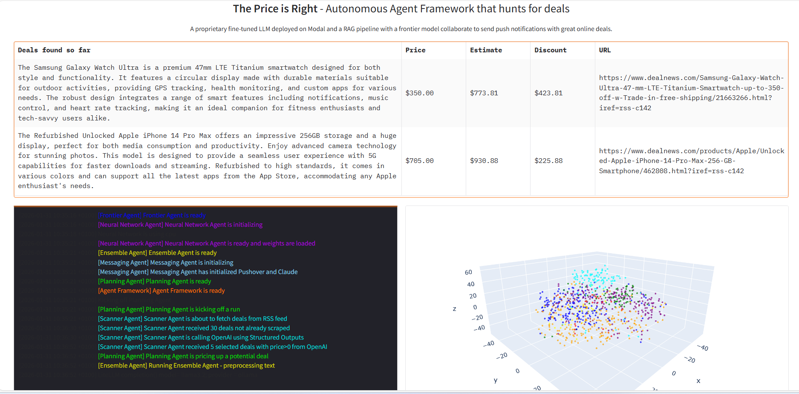
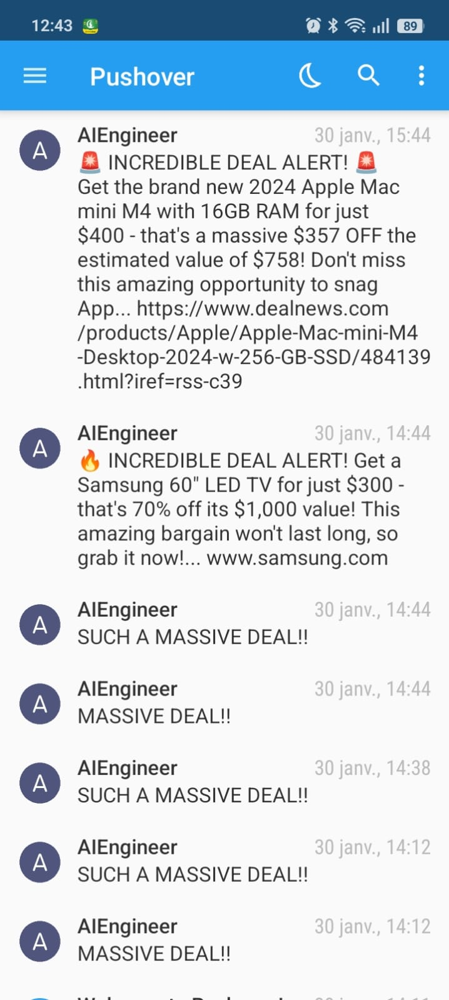

# 🏷️ The Price is Right — Autonomous Agent Framework for Deal Hunting

An end‑to‑end **autonomous multi‑agent system** that scans the web for online deals, estimates fair market prices using ML + LLMs, and notifies users when a deal is truly worth it.

This project focuses on **speed, cost‑efficiency, and modular agent design**, making it easy to extend or scale from a lightweight dataset to a full production‑grade pipeline.

---

## 🚀 Project Overview

**The Price is Right** combines:

* A **lightweight ML pricing model**
* A **RAG‑based frontier LLM**
* A **coordinated agent framework**

The system autonomously:

1. Scans deal sources (RSS / feeds)
2. Identifies promising offers
3. Estimates true market value
4. Computes discounts
5. Sends push notifications for high‑value deals

---

## 🧠 Agent Architecture

The project is built around a **multi‑agent workflow**, where each agent has a clear responsibility.

### 📊 Agent Workflow Diagram

### Agent Roles

* **UI (Gradio)**
  User interface for monitoring deals, logs, and results.

* **Agent Framework**
  Handles memory, logging, orchestration, and lifecycle management.

* **Planning Agent**
  Coordinates the entire workflow and decides which agents to trigger.

* **Scanner Agent**
  Fetches and filters deals from RSS feeds and external sources.

* **Frontier Agent (RAG Pricer)**
  Uses retrieval‑augmented generation to estimate realistic market prices.

* **Ensemble Agent**
  Combines predictions from multiple models to produce robust price estimates.

* **Specialist Agent**
  Focused pricing logic for specific product categories.

* **Neural Network Agent**
  ML‑based regression model trained on historical pricing data.

* **Messaging Agent**
  Sends push notifications (e.g. Pushover) when a deal is detected.

---

## 🖥️ Final Application Output

In addition to the UI dashboard, the system also sends **real-time push notifications** when a high-value deal is detected.

The system produces a live dashboard showing:

* Detected deals
* Estimated fair price
* Actual deal price
* Computed discount
* Source URL

### 📸 Final Result Screenshot

---

## 🔔 Push Notifications (Pushover)

When the agent framework identifies a deal with a significant discount, the **Messaging Agent** automatically sends a push notification via **Pushover**.

### 📱 Pushover Notification Example

> ℹ️ **Note**: The screenshot above shows a real notification sent by the agent. If you clone this repository, simply add your own screenshot at the path:
>
> `images/pushover_notification.png`

This keeps the README clean while allowing contributors to easily plug in their own notification results.

---

## ⚡ Dataset Choice: Lite vs Full

To optimize **speed and cost**, this project uses a **lite dataset by default**.

### Why Lite Dataset?

* 🚀 Faster execution
* 💰 Lower LLM inference cost
* 🔁 Faster iteration during development
* 🧪 Ideal for testing agent workflows

This is especially important when working with **LLM‑based agents**, where token usage directly impacts cost.

### Full Dataset Support

If you want to run the system on the **full dataset**:

* All dataset links are provided inside the project files
* You can switch datasets by updating the configuration
* No code refactor is required

This design makes the system **production‑ready**, while keeping development lightweight.

---

## 🧩 Tech Stack

* **Python**
* **Gradio** (UI)
* **LLMs (via OpenAI / Claude / OpenRouter)**
* **RAG pipeline**
* **Neural Networks (price regression)**
* **Agent‑based architecture**
* **Push notifications (Pushover)**

---

---

## ✅ Key Highlights

* Modular, extensible agent framework
* Cost‑aware LLM usage
* Hybrid ML + LLM pricing strategy
* Clear separation of responsibilities
* Easy transition from lite to full dataset

---

## 📌 Notes

This project is designed to be:

* **Educational** (clear agent roles)
* **Scalable** (swap datasets, models, or agents)
* **Production‑ready** (logging, orchestration, monitoring)

---

✨ Feel free to fork, extend, or adapt this system for other autonomous agent use cases like monitoring, forecasting, or recommendation engines.
